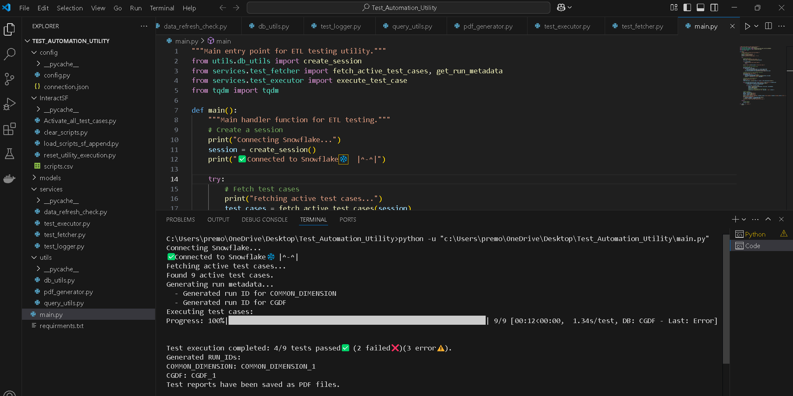

# Automated Data Validation and Reporting Framework for Snowflake Pipelines

> **🎥 Video Demo:** [Click here to watch the execution demo](https://drive.google.com/file/d/1Xz0n2JIJPMugii1DEMVc9_L16b_zMouA/view?usp=sharing)
> **Docmentation:**   [DOC](https://github.com/premoswalp09/TESTING-AUTOMATION/blob/main/Documentation_VCC.pdf)

## 🚀 Project Overview

This project delivers a robust automation framework for validating data across different stages in **Snowflake-based data pipelines**.

The utility performs:
- ✅ Count Checks
- 🔍 Data-level Comparisons

It ensures consistency between staging and target tables and auto-generates a **detailed PDF report** summarizing:
- ✔️ Matched Records
- ❌ Mismatches
- 📊 Overall Validation Status

This modular, lightweight solution integrates easily with CI/CD workflows, enabling faster and more reliable data pipeline testing.

---

## 🧰 Technologies Used

- **Snowflake**
- **Snowpark**
- **Python**
- **ReportLab**
- **VS Code**

---

## ⚙️ Installation & Setup

1. Create a folder and open it in **VS Code**.
2. Clone the repository:
   ```bash
   git clone https://github.com/premoswalp09/TESTING-AUTOMATION.git
   ```
3. Modify the `connection.json` file with your Snowflake credentials:
   ```json
   {
     "account": "your_account_id.region.gcp",
     "user": "your_username",
     "password": "your_password",
     "role": "your_role",
     "warehouse": "your_warehouse",
     "database": "your_database",
     "schema": "your_schema"
   }
   ```
4. In VS code terminal, Run -
   ```bash
   pip install -r requirments.txt
   ```
5. Set up your Snowflake trial account and execute the DDLs provided in the `setup_ddl/` directory using the Snowflake SQL worksheet.

---

## ▶️ How to Run the Project

1. Upload test cases in the `TEST_SCRIPTS` table (make sure `active_flag = 'Y'`).
2. In VS Code, run:
   ```bash
   python main.py
   ```
   > 📌 Ensure your Snowflake connection is correctly configured.

3. After execution, results will be available:
   - ✅ Validation Summary Report: in the `TEST_RESULTS` stage
   - ❌ Mismatches (if any): in the `MISMATCH_RESULTS` stage

Both stages are located in the **`public` schema**.

---

## 🖼️ Execution Screenshot

<p align="center">
  
</p>

---

## 👨‍💻 Contributors

- **Prem Oswal** (M23AID037)
- **Chirag Chinmay**
- **Pritish Tripathy**
- **Doyel Saha**

---

## 📄 License

This project is for academic and internal use. Licensing can be added based on future needs.
